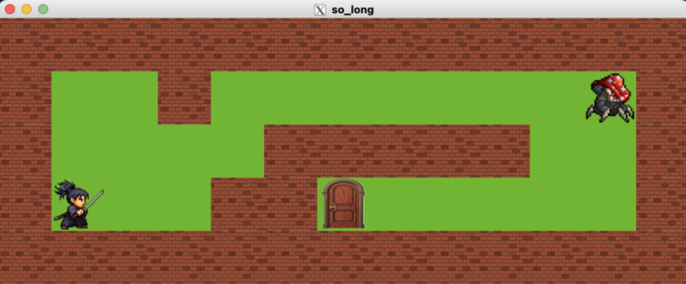

# So_long

A small 2D tile-based game for the 42 curriculum using **MiniLibX**. The goal is to load a map, collect all items, and exit—tracking and displaying the move count.

## Requirements
- **Language:** C
- **Compiler:** `cc` with `-Wall -Wextra -Werror`
- **Graphics:** MiniLibX (macOS or Linux)
- **Build:** `make`
- **OS deps (example):**
  - **macOS:** `-lmlx -framework OpenGL -framework AppKit`
  - **Linux:** `-lmlx -lXext -lX11 -lm` (ensure X11 dev packages installed)

## Build
```bash
make         # builds so_long
make clean   # remove .o
make fclean  # remove .o and binaries
make re      # full rebuild
```

## Usage
```bash
./so_long assets/maps/valid_simple.ber
```

  

```bash
Controls: W/A/S/D, ESC or window close to quit.
```
**HUD:** prints **move count** (on terminal).

## Map Format (`.ber`)
- **Characters:**
  - `1` = wall
  - `0` = empty floor
  - `P` = player start (**exactly 1**)
  - `E` = exit (**at least 1**)
  - `C` = collectible (**at least 1**)
- **Rules:**
  - Rectangular; surrounded by walls (`1`) on borders.
  - Contains only allowed characters.
  - **Path validity:** from `P`, all `C` and at least one `E` must be reachable.
- **Example:**
  ```text
  111111
  1P0C01
  100001
  1C0E01
  111111
  ```

## Behavior
- Each valid keypress moves 1 tile if not blocked by a wall.
- The move counter increments per successful move and is displayed.
- Game ends when all `C` collected and the player reaches an `E`.
- On any invalid input or map error, write **exactly** `Error\n` to `STDERR` (optionally followed by a short message if allowed by your subject).

## Testing
- Maps with: no collectibles, multiple exits, invalid chars, non-rectangular shapes, open borders, unreachable `C`/`E`, huge maps.
- Resize and asset integrity: missing textures should fail cleanly.
- Run Valgrind (Linux) or leaks (macOS) to ensure no memory/resource leaks.

## Notes
- Keep rendering minimal inside the MLX loop; update only on changes.
- Free all allocations on normal exit and on error paths.
- Avoid global state; split parsing, pathfinding, rendering, and input.
- Use BFS/DFS for path validation on a copy of the map.
